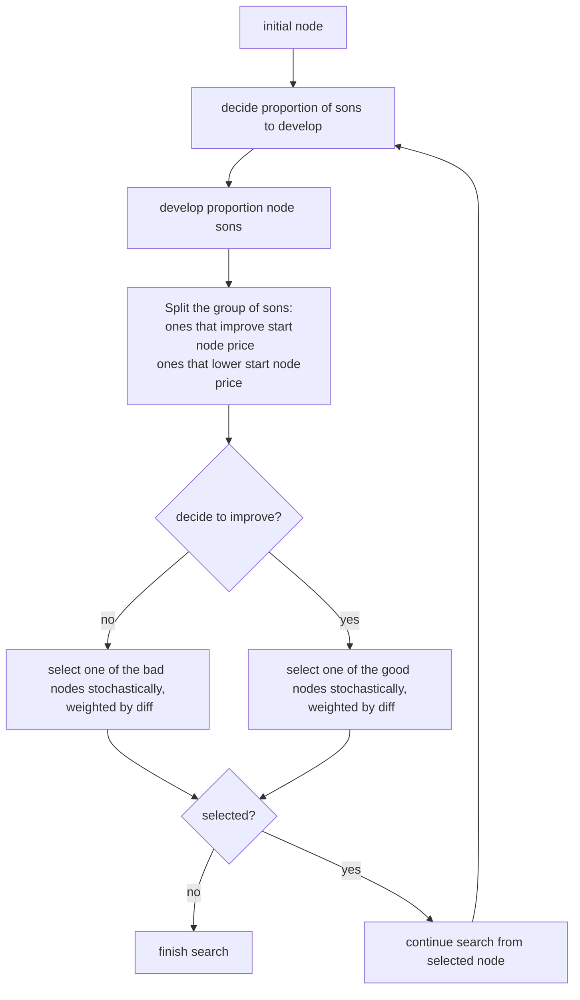

THE PROJECT HAS BEEN MOVED - This project is still under development, but it has been moved to another repository:

https://github.com/aicoe-aiops/cloud-price-analysis-public/tree/master/src/CloudCostOptimizer%20(CCO)

# Cloud Cost Optimizer
The goal of the project is to provide the user an api for getting [AWS spot instances](https://aws.amazon.com/ec2/spot/) (or on-demand) best offers based on a given configuration.
The Optimizer first gets from the user application(s) requirements such as OS, region, cpu, memory, storage, network, etc..
After calculating All the options, the Optimizer suggests the user the cheapest configuration of EC2 instances to run their app.

## Getting Started
To start using The Cloud Cost Optimizer, please clone this git repository:
```
git clone https://github.com/AdiY10/CloudCostOptimizer.git
```
### Prerequisites
* The Cloud Cost Optimizer requires Python3- Python 3.4 or newer installed. You can check the version by typing ```python3 --version``` in your command line.
* You can download the latest Python version from [here](https://www.python.org/downloads/).

### Installation
```
$ python -m pip install requests
$ pip3 install urllib3
$ pip install grequests
$ pip install numpy
```

### Usage
```
$ python3 Fleet_Optimizer.py
```
Where the following command activate the Optimizer

## Parameters
The file **input_fleet.json** is an example of an input (see input_fleet_instructions.json for more explanations).
The user's workload should be in the **input_fleet.json** file- **don't forget to change it according to your needs.**
#### Example of an input json file:
```
{
    "selectedOs": "linux",
    "region": ["eu-south-1", "eu-west-3", "us-east-2","us-east-1"],
    "spot/onDemand": "spot",
    "filterInstances": ["a1","t3a","c5a.xlarge"],
    "AvailabilityZone": "all",
    "Architecture": "all",
    "apps": [
        {
            "app": "App1",
            "share": true,
            "components": [
                {
                    "memory": 8,
                    "vCPUs": 4,
                    "network": 5,
                    "behavior": "terminate",
                    "frequency": "2",
                    "storageType": null,
                    "name": "Comp1"
                },
                {
                    "memory": 8,
                    "vCPUs": 3,
                    "network": 0,
                    "behavior": "hibernate",
                    "frequency": "3",
                    "storageType": null,
                    "burstable": true,
                    "name": "comp2"
                },
                                {
                    "memory": 8,
                    "vCPUs": 3,
                    "network": 0,
                    "behavior": "hibernate",
                    "frequency": "3",
                    "storageType": null,
                    "burstable": true,
                    "name": "comp5"
                }
            ]
        },
        {
            "app": "App2",
            "share": false,
            "components": [
                {
                    "memory": 10,
                    "vCPUs": 5,
                    "network": 0,
                    "behavior": "stop",
                    "frequency": "4",
                    "storageType": null,
                    "burstable": true,
                    "name": "Comp3"
                }
            ]
        }
    ]
}
```

Where we can see an input of two Applications (App1, App2), which uses linux Operation System.
App1 includes three components (Comp1, Comp2, Comp5), and App2 includes one component (Comp3). each component
has different resource requirements, which describes by the memory, vCPUs etc...

#### Required parameters:
* vCPUs - min number of vCPUs in the instance
* Memory (GB) - min memory (RAM) size in the instance
* OS - operating system for the instance
* spot/onDemand - choose AWS instances pricing option- **spot / on-Demand**
#### Optional parameters:
* Region - used if a specific region is required, otherwise, searches in all regions.
  * region defined as "all"- to look for the best configuration, in all regions
  * region defined as specific region, for example "us-east-2"- to look for the best configuration only in us-east-2
  * region defined as list of multiple regions- ["eu-west-1","eu-east-2","sa-east-1"]- to look for the best configuration in these regions
* AvailabilityZone - used if specific AZ is required
* filterInstances - used if specific instance types (major, minor or instance type) should not be displayed by Optimizer- for example, if major type a1, and instance type c5.large are not relevant, insert- filterInstances: ["a1","c5.large"]
* Architecture - processor architecture, can be selected as- 'all' / 'x86_64' (64-bit x86) / 'arm64' (64-bit arm) / 'i386' (32-bit) / 'x86_64_mac' (64-bit mac)
* typeMajor - Used when specific instance types are required. For example, when only C5, R5, A1 are supported- insert "typeMajor": ["c5", "r5", "a1"]
* Category - specifies the instance category- General Purpose, Compute Optimized, Memory Optimized, Media Accelerator Instance, Storage Optimized, GPU instance.
* Interruption Behavior- display only instances meeting a specific interruption behavior criteria (stop / hibernate / terminate) - in case of using Spot instances.
* Interruption frequency- Represents the rate at which Spot will be reclaimed capacity (0- *< 5%*,1- *5-10%*,2- *10-15%*,3- *15-20%*, 4- *>20%*)
* Network - required network capacity
* IOPS (MiB I/O) - max IOPS per volume.
* Throughput (MiB/s)- max throughput per volume.
#### Configuration file:
A configuration file with advanced settings is provided to the user, which allows him to edit default settings according to his preferences, such as data extraction methodology, cloud provider, boto3 usage parameters, search algorithm parameters, etc..
## Results
The output of the Optimizer is a json file containing  a list of configurations. Each configuration represents an assignment of all application components to AWS instances.

### Example of the API- Best Result Only:
```
[
    {
        "price": 0.275,
        "instances": [
            {
                "onDemandPrice": 0.204,
                "region": "us-east-2",
                "cpu": "8",
                "ebsOnly": true,
                "family": "General purpose",
                "memory": "16",
                "network": "Up to 10 Gigabit",
                "os": "Linux",
                "typeMajor": "a1",
                "typeMinor": "2xlarge",
                "storage": "EBS only",
                "typeName": "a1.2xlarge",
                "discount": 81,
                "interruption_frequency": "<20%",
                "interruption_frequency_filter": 4.0,
                "spot_price": 0.0394,
                "Price_per_CPU": 0.004925,
                "Price_per_memory": 0.0024625,
                "components": [
                    {
                        "appName": "App2",
                        "componentName": "Comp3"
                    }
                ]
            },
            {
                "onDemandPrice": 0.344,
                "region": "us-east-2",
                "cpu": "8",
                "ebsOnly": false,
                "family": "Compute optimized",
                "memory": "16",
                "network": "Up to 10 Gigabit",
                "os": "Linux",
                "typeMajor": "c5ad",
                "typeMinor": "2xlarge",
                "storage": "1 x 300 NVMe SSD",
                "typeName": "c5ad.2xlarge",
                "discount": 78,
                "interruption_frequency": "<5%",
                "interruption_frequency_filter": 0.0,
                "spot_price": 0.076,
                "Price_per_CPU": 0.0095,
                "Price_per_memory": 0.00475,
                "components": [
                    {
                        "appName": "App3",
                        "componentName": "Comp4"
                    }
                ]
            },
            {
                "onDemandPrice": 0.6912,
                "region": "us-east-2",
                "cpu": "16",
                "ebsOnly": true,
                "family": "Compute optimized",
                "memory": "32",
                "network": "25 Gigabit",
                "os": "Linux",
                "typeMajor": "c6gn",
                "typeMinor": "4xlarge",
                "storage": "EBS only",
                "typeName": "c6gn.4xlarge",
                "discount": 77,
                "interruption_frequency": "5%-10%",
                "interruption_frequency_filter": 1.0,
                "spot_price": 0.1596,
                "Price_per_CPU": 0.009975,
                "Price_per_memory": 0.0049875,
                "components": [
                    {
                        "appName": "App1",
                        "componentName": "Comp1"
                    },
                    {
                        "appName": "App1",
                        "componentName": "comp2"
                    },
                    {
                        "appName": "App1",
                        "componentName": "comp5"
                    }
                ]
            }
        ],
        "region": "us-east-2"
    },
    {
        "price": 0.3,
        ...
    }
]
```

## Algorithm Description

### General Description
The algorithm Is split into epochs.
each epoch is a combination of 2 phases:
  - **searching** - search for combiniation with minimal price. the search is based on Simulated Annealing and Stochastic Hill Climbing. 
  - **selecting the next node to start searching from** -
    -  can use Reset Selector (based on heuristic) 
    -  can select randomly.


#### Search Algorithm
the search is based on Simulated Annealing and Stochastic Hill Climbing.


#### Reset Selector
The Reset Selector is based on Random Restart and Exploration & Exploitation.
Keep an array of “good” nodes that we have already visited, always select starting nodes from it.
After each decent iteration (epoch), give the reset selector the list of nodes visited during the seach; the best of them will be saved in the array.

### HyperParameter 

- **candidate list size** - The maximum capacity of the array of Reset Selector.

- **time per region** - The amount of time [seconds] the algorithm is allowed to run on each of the regions .

- **proportion amount node sons to develop** - Initial proportion to develop at each epoch.

- **exploitation score price bias** - Proportion between price score and subtree score.

- **exploration score depth bias** - Proportion between depth score and uniqueness score.

- **exploitation bias** -  Proportion between exploitation score and exploration score.


